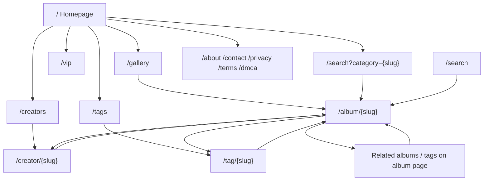

# Crawl Graph Audit — Yukvix.com

**Audit date:** 2026-07-04  
**Method:** Route map + internal link analysis from codebase + sitemap cross-check  
**Post:** SEO Sprint 1 + SEO Foundation

---

## Crawl Graph (intended)

---

## Entry Points (indexable)

| URL pattern | In sitemap | Server meta | Notes |
|-------------|------------|-------------|-------|
| `/` | ✅ | ✅ | Primary entry |
| `/gallery` | ✅ | ✅ | Main discovery hub |
| `/album/{slug}` | ✅ (156) | ✅ | Money pages |
| `/creator/{slug}` | ✅ (39) | ✅ | Profile hub |
| `/tag/{slug}` | ✅ (496) | ✅ | Long-tail collections |
| `/creators`, `/tags` | ✅ | ✅ | Directory pages |
| `/search?category={slug}` | ❌ | ✅ | Linked from homepage category chips |
| `/about`, `/contact`, etc. | ✅ partial | ✅ | Trust pages |
| `/search?q=` | ❌ | noindex | Filtered search — intentional |
| `/browse` | ❌ removed | 301→gallery | Sprint 1 fix |

---

## Findings

### 1. Dead Ends (low outbound internal links)

| Page | Issue | Severity |
|------|-------|----------|
| `/vip` | Marketing page; limited deep links to albums | Low |
| `/about`, `/contact`, `/dmca` | Footer links only; no album cross-links | Low (expected for static) |
| `/404` | Terminal | OK |

**Mitigation (future, not in scope):** Add “Featured albums” block on static pages — not implemented (no feature add).

### 2. Orphan Risk (weak inbound links)

| Page type | Risk | Detail |
|-----------|------|--------|
| `/tag/{slug}` | Medium | 496 tags; only reachable via `/tags` directory, album tag chips, sitemap — no homepage tag list |
| `/creator/{slug}` | Low | Linked from album pages + `/creators` + sitemap |
| Category via `/search?category=` | Medium | Not in sitemap; relies on homepage category section |
| Old albums | Low | In sitemap + gallery pagination |

### 3. Thin Link Pages

| Page | Issue |
|------|-------|
| `/tags` | Paginated directory; may expose many links per page — OK for crawl budget |
| `/creators` | Same pattern |

### 4. Weak Internal Links

| From | To | Gap |
|------|-----|-----|
| Homepage | Tags | No direct tag links (only categories → search) |
| Gallery | Creators | Filter UI only; no prominent creator nav |
| Tag page | Creator | Album cards only; no “top creators for tag” block |
| Category search | Gallery | Separate URL pattern from `/gallery?category` (gallery uses state, not URL) |

### 5. Resolved (Sprint 1 + Foundation)

| Issue | Status |
|-------|--------|
| `/browse` dead URL in sitemap | ✅ 301 + removed |
| Soft 404 on missing entities | ✅ HTTP 404 |
| Missing server canonical | ✅ Foundation Phase A |
| Missing server JSON-LD on albums | ✅ Foundation Phase B |
| `www` duplicate host | ✅ 301 apex |

---

## Crawl Budget Notes

- **496 tag URLs** in sitemap — monitor GSC “Discovered” after Foundation deploy.
- **Tag SEO content empty** (496/496 missing title+desc) — use Phase C bulk tool; thin content risk until filled.
- **Search filtered URLs** (`noindex`) — correct; should not compete with gallery/category.

---

## Recommendations (Owner — post monitoring, not Sprint 2 yet)

1. Add category landing URLs to sitemap after GSC shows category pages indexed.
2. Run Tag SEO bulk AI for missing 496 tags (Admin → Tags).
3. Consider homepage “Popular tags” section (Sprint 2+ — requires product approval).
4. Purge Cloudflare cache after robots/sitemap changes if stale.

---

## Link Sources Reference

| Component | Links to |
|-----------|----------|
| Navbar | Gallery, Creators, Tags, VIP, Search |
| Homepage hero | Gallery, VIP |
| Homepage categories | `/search?category={slug}` |
| Album detail | Creator, tags, related albums, breadcrumb |
| Footer | Static pages, gallery, creators |
| Sitemap | All published albums, creators, tags, static |
